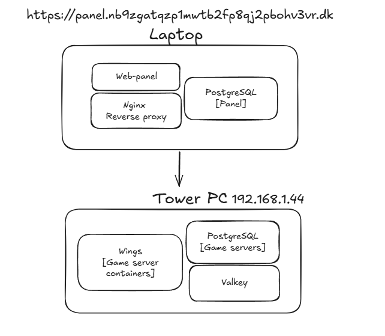
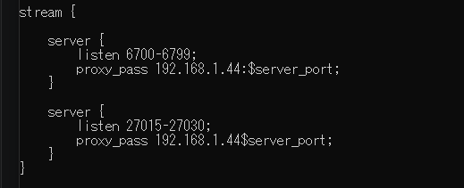
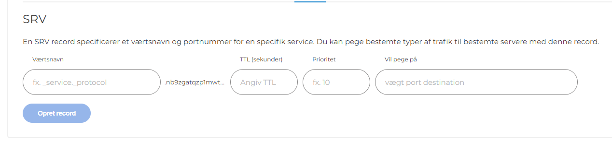

For a long period of time my friends and I had a bunch of game servers running simultaneously, if I recall correctly, we had a Valheim server, a Factorio server, a CS2 deathmatch server and currently we also have a Windrose server. Whilst running them all at once is definitely possible, I have utility bills to pay, and furthermore, I live with the server next to me, I prefer to keep the CPU usage to a minimum so I don't drive myself insane with a high revving fan running 24/7.

Our solution at the time was just to write to me on Discord when they needed the server up, this worked for a while, but quickly got tedious the more people depended on it. 

My initial thought was to make a Discord bot on our community server, instead of writing to me to start / stop servers, people could just do commands in a designated channel. Whilst this solution looked interesting to implement, making a bespoke bot just for the heck of it wasn't really within my schedule. Perhaps there is a open-source solution already on the market?

# Pterodactyl
Literally the first result on the Google search was what I was looking for, a web-panel connected to container orchestration with authentication and authorization already baked in, specifically made for game servers. Perfect. About half an hour of reading later, I was ready to set it up. 

I ended up with this setup

My laptop handling the nginx web-server which is hosting the panel itself, alongside a database so my friends can have accounts on it, and finally the reverse proxy handling inbound traffic to other than the panel itself. 

The tower pc, with a more powerful CPU, handling running the game servers themselves, using something I've never seen before called Wings. Essentially it's just Kubernetes, but instead of orchestrating container images, it uses eggs (which are actually just docker images).

Furthermore, it also has a cache (Valkey) and a database, which would be useful for servers requiring them, but our servers don't strictly require them, so I they're essentially optional in my setup. If you hosted something like a CS2 surf server with a leaderboard, or a FiveM server with an economy, you would definitely be using both of them, but not us.

Whilst the initial setup itself was essentially a guided TUI experience, some of the smaller stuff like forwarding traffic for the servers themselves, which is UDP, was not included in the guide, it is however standard practice with nginx so it was somewhat straight forward. 

Finally I can talk a bit about the DNS. For this little setup, I bought a .dk-domain for less than 10 DKK, I won't mention the name of the provider, but I wouldn't recommend any companies rhyming with Juan, their web-sites are an awful experience to use. 

It was also around this time I encountered something called a SRV record, which is used for locating services, and in my case, I could use it to locate game servers. E.g. I can make factorio.<domain>.dk point at the port used by our Factorio server, valheim.<domain>.dk to point at the port used by Valheim, and so on and so forth. Very useful, if both of those games support SRV lookups, in this case only factorio does. Surprisingly few modern games actually bother implementing this.

Anyway, I set the A-name record to point at my public IP, and after quickly fixing the forwarding on my router, as the domain actually actually showed my router firmware login-page for a short while, I had public access for the web-panel. Giving my friends a quick tour of it and then giving them their credentials we were up and running.

