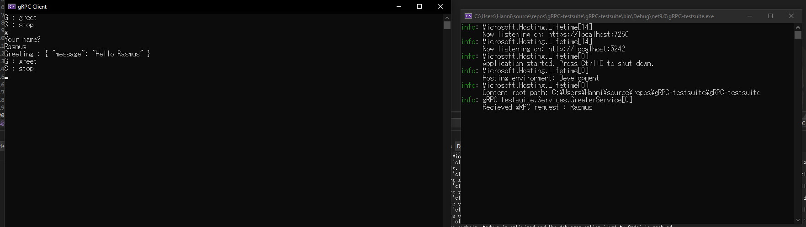

In this blogpost, I'll go through a small experiment I did earlier in the day, trying to get some experience using gRPC. The overall steps were : 

- Setup a **simple** gRPC server
- Setup a **simple** gRPC client
- Setup a shared project library for future testing 
- Try sending request and log results

First up, creating a service that will recieve and handle requests. This code was generated through creating a gRPC service with VS 2022, all I did was add some further logging for testing purposes. 

```csharp
  public class GreeterService : Greeter.GreeterBase
  {
      private readonly ILogger<GreeterService> _logger;
      public GreeterService(ILogger<GreeterService> logger)
      {
          _logger = logger;
      }

      public override Task<HelloReply> SayHello(HelloRequest request, ServerCallContext context)
      {
          _logger.LogInformation("Recieved gRPC request : {name}", request.Name);
          _logger.LogInformation("Request : {req}", request.ToString());
          return Task.FromResult(new HelloReply
          {
              Message = "Hello " + request.Name
          });
      }
  }
```

Next in line is creating the client side handling, this is a snippet of the code actually doing the work of creating a communication channel, instantiatng a client to communicate through said channel, and finally sending a request.

```csharp
  using var channel = GrpcChannel.ForAddress("https://localhost:7250");
  var client = new Greeter.GreeterClient(channel);
  Console.WriteLine("Your name?");
  string? name = Console.ReadLine();
  var reply = await client.SayHelloAsync(new HelloRequest { Name = name });Console.WriteLine("Greeting : " + reply);
```

Thirdly, creating a protobuffer specification for both server- and clientside, which I have chosen to do in a shared project between client and server, as is best practice. The protobuffer is as follows:

```protobuf
syntax = "proto3";

option csharp_namespace = "shared.Proto";

package greet;

// The greeting service definition.
service Greeter {
  // Sends a greeting
  rpc SayHello (HelloRequest) returns (HelloReply);
}

// The request message containing the user's name.
message HelloRequest {
  string name = 1;
}

// The response message containing the greetings.
message HelloReply {
  string message = 1;
}
```

And finally, running the damn code. Terminal outputs for both the client and server are shown in the image below.



And that about wraps it up, from this I've gathered the basic usage of gRPC is fairly straightforward, this is however a fairly trivial statement, as anything basic is usually quite straightfoward... Anyhow, that's it for me.